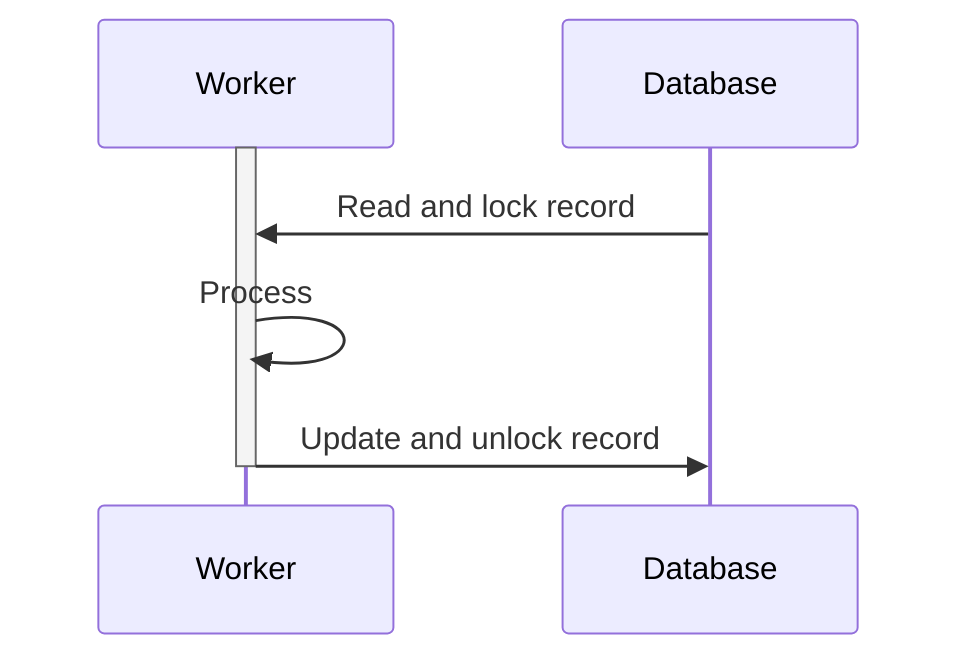

# Overview

This is a simple project demonstrating how to use a SQL database as a queue.

Probably a bad idea for large workloads, but it's a good enough solution for small workloads.
1. Easy to implement.
2. Eliminates the need to add a whole queue system to your stack
   (highly relevant for teams that at present don't have enough resources to do that).
3. Allows you to view and manage the tasks with SQL, simplifying operations. 

# Run

```bash
docker-compose up
```

Spins up a MySQL database and a couple of workers that process tasks from the database.
In the docker-compose file:
- The number of tasks can be changed with the `init.environment.TASKS` env value.
- The number of workers can be changed with the `worker.deploy.replicas` value.

## Creating tasks

You can create tasks by simply inserting rows into the `Task` table.
```sql
INSERT INTO Task (status) VALUES ("pending");
```

They will get automatically picked up by the workers.

# How it works



1. A task is added to the queue by inserting a row into the `Task` table.
2. A worker reads from the `Task` table and locks the row. 
   This is achieved with `SELECT ... FOR UPDATE SKIP LOCKED`.
3. The worker processes the task and updates the row as needed.
4. The worker commits the transaction, releasing the lock.
